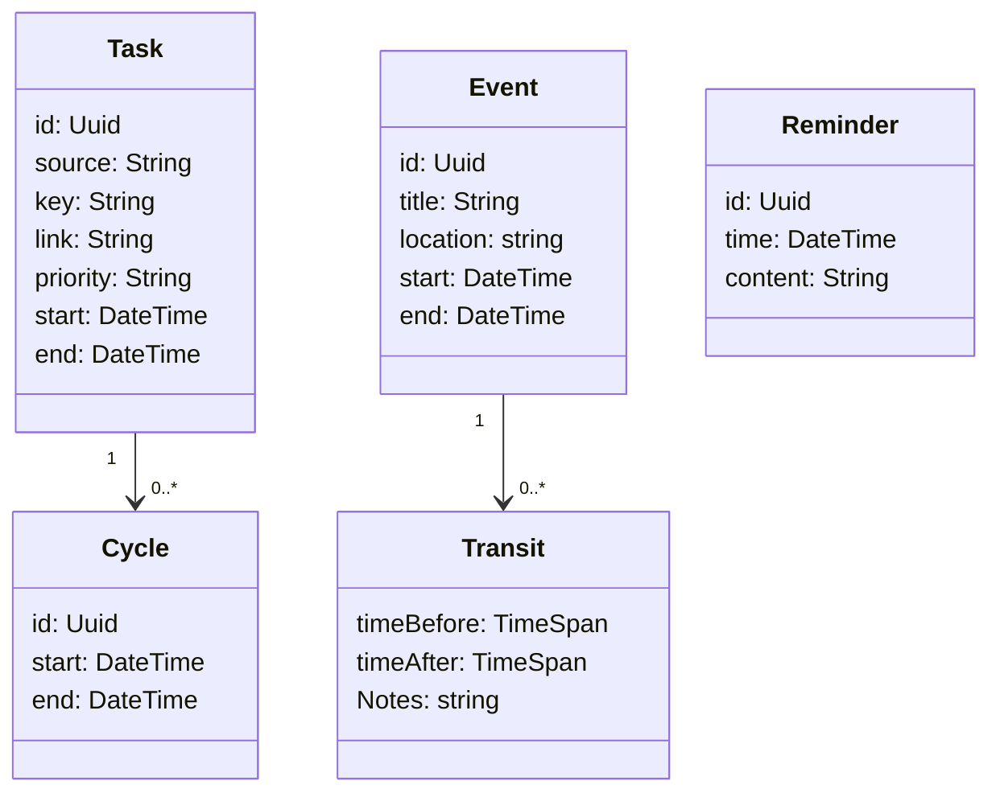

# FlightPlan
Productivity and wellbeing for nerds.

```mermaid
classDiagram
    class Task {
        id: Uuid
        source: String
        key: String
        link: String
        priority: String
        start: DateTime
        end: DateTime
    }

    class Cycle {
        id: Uuid
        start: DateTime
        end: DateTime
    }

    class Event {
        id: Uuid
        title: String
        location: string
        start: DateTime
        end: DateTime
    }

    class Transit {
        timeBefore: TimeSpan
        timeAfter: TimeSpan
        Notes: string
    }

    class Reminder {
        id: Uuid
        time: DateTime
        content: String
    }

    Task "1" --> "0..*" Cycle
    
    Event "1" --> "0..*" Transit
    
```